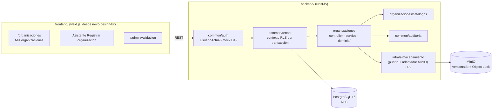

<!--
  PLANTILLA AI-DLC — design.md (canonical: .agents/templates/spec/)
  Se llena DESPUÉS de que requirements.md esté aprobado (o al menos
  estable). Aquí sí va el CÓMO: arquitectura, contratos, datos.

  GUARDRAILS:
  - Todo componente/abstracción nuevo debe justificarse con un R*.*
    o NFR concreto. Si ningún requirement lo exige, no va — o se
    declara en "Complejidad justificada".
  - Cruzar con stack/architecture.md y stack/constraints.md: el
    design no contradice el stack declarado del repo.
  - Decisiones con notación DEC-N (no D-N — reservado a Dependencies).
  - Registrar alternativas rechazadas: el "por qué no" vale tanto
    como el "por qué sí" (evita re-litigar en amendments).

  SECCIONES QUE NO APLICAN — dos casos distintos, y confundirlos
  le cobra la disciplina a quien no la declaró:

  a) La capacidad NO está declarada en repo-config.yaml (no hay
     `disciplines`, no hay tracker…) → la sección **SE BORRA ENTERA**.
     No se puede "considerar y descartar" una disciplina que el repo
     no tiene, y dejarla obliga a resolverla en G2 (check 0).
  b) La capacidad SÍ está declarada pero no aplica a ESTA feature →
     se marca `N/A — <razón>`.

  Regla corta: **capacidad no declarada se borra; capacidad declarada
  que no aplica se marca**. Las secciones condicionales llevan escrito
  de qué capacidad dependen.

  Para el caso (b), la marca va `N/A — <razón>`
  en una línea. Ejemplo: "## Observabilidad — N/A: no agrega
  endpoints ni jobs; la métrica existente cubre el cambio".
  Por qué marcar y no borrar: un design.md sin sección de Seguridad es
  ambiguo —¿se consideró y se descartó, o se olvidó?—. La marca deja
  escrito que se consideró, y es lo que `/spec-verify --pre-g2`
  (check 0) exige para firmar G2: toda sección resuelta, llena o N/A.
  Ojo: `N/A` no es un atajo. No se puede marcar N/A en Modelo de datos
  si algún R*.* persiste algo.
-->
# Design: Organizaciones

## Arquitectura

Es la primera feature con código del repo: crea el esqueleto del
monorepo (`stack/architecture.md`) y, dentro de él, el módulo
`organizaciones` y las piezas transversales que este módulo necesita
primero (contexto de tenant con RLS, auditoría, identidad simulada).



- **Controller → service → Prisma** (`stack/architecture.md`). La
  lógica pura (estándares aplicables, dígito de verificación) vive en
  `organizaciones/dominio/` sin dependencias de framework, para
  probarla con unit tests.
- **Organizaciones es la raíz del tenant.** Sus endpoints no operan
  "dentro" de una organización activa (el Líder SST todavía no ha
  ingresado a ninguna); el aislamiento se da por **membresía**
  (DEC-2). Los módulos siguientes sí operarán con el `organizacionId`
  activo del token, que emitirá `auth` (D1) al "Ingresar" (R5.4).
- El frontend se crea moviendo `nexo-design-kit/` a `frontend/`
  (DEC-8) y portando las vistas del mockup.

## Componentes

| Componente | Responsabilidad | Justificado por |
|---|---|---|
| `backend/src/organizaciones/organizaciones.controller.ts` | Endpoints REST de la sección Contratos; solo valida DTOs, autoriza y delega | R1.*–R8.* |
| `backend/src/organizaciones/organizaciones.service.ts` | Registro, corrección, ciclo de estados, listados; exporta `esMiembro()` y `puedeIngresar()` para `auth`/`accesos` | R4.*, R5.*, R6.1 |
| `backend/src/organizaciones/dominio/estandares-aplicables.ts` | Función pura: sedes → `{ estandares, riesgoMaximo, totalTrabajadores, regla }` | R3.1–R3.6 |
| `backend/src/organizaciones/dominio/digito-verificacion.ts` | Función pura: DV del NIT por módulo 11 (DIAN) | R1.6 |
| `backend/src/organizaciones/dominio/transiciones.ts` | Tabla de transiciones de estado permitidas por rol | R4.3–R4.10, R8.6 |
| `backend/src/organizaciones/catalogos/` | Lectura de DIVIPOLA, CIIU y ARL; búsqueda CIIU | R1.9, R2.5–R2.7 |
| `backend/src/organizaciones/documentos/` (P2) | Carga, versionado y URLs firmadas de documentos legales | R7.* |
| `backend/src/common/auth/` | `UsuarioActual` y guard de rol de plataforma. En P1 lo alimenta el mock de D1 | R4.9, R6.2, D1 |
| `backend/src/common/tenant/` | Extensión de Prisma que abre cada operación en una transacción con `set_config` de las variables de sesión que leen las políticas RLS | R6.1, NFR3, DEC-1 |
| `backend/src/common/auditoria/` | Servicio append-only sobre `AuditoriaCambio` | R6.3, R6.4, R8.4, NFR4 |
| `backend/src/infra/almacenamiento/` (P2) | Puerto `AlmacenamientoArchivos` + adaptador MinIO | R7.2–R7.8, NFR5 |
| `frontend/src/app/organizaciones/` | "Mis organizaciones" con datos reales, estado vacío, conteo y motivo de devolución | R5.1–R5.7 |
| `frontend/src/components/organizaciones/asistente/` | Asistente de 3 pasos portado de `#modal-nueva-organizacion` (paso 3 en P2) | R1.*, R2.*, R3.6, R7.* |
| `frontend/src/app/admin/validacion/` | Cola de validación y detalle con Aprobar / Devolver | R5.8, R5.9, R4.3–R4.5 |
| `frontend/src/app/sgsst/config/` (P3) | Sección de datos generales, sedes y documentos de `#view-config`, editable | R8.* |

## Modelo de datos

Prisma (PostgreSQL 16). Todas las tablas de negocio llevan
`organizacionId` y RLS forzado (`ENABLE` + `FORCE ROW LEVEL SECURITY`).
Los catálogos son globales y de solo lectura para la aplicación.

```prisma
enum EstadoOrganizacion { EN_VALIDACION  DEVUELTA  APROBADA }
enum TipoPersona        { JURIDICA  NATURAL }
enum TipoDocumento      { CC  CE  PASAPORTE }
enum ClaseRiesgo        { I  II  III  IV  V }
enum RolOrganizacion    { LIDER_SST  LIDER_APOYO  PRACTICANTE }  // solo LIDER_SST en esta feature
enum TipoDocumentoLegal { RUT  CAMARA_COMERCIO  CEDULA_REP_LEGAL  FORMULARIO_ARL  NO_AFILIACION_ARL }

model Organizacion {
  id                   String             @id @default(uuid())
  razonSocial          String
  nombreComercial      String?            // R1.8: si es null se muestra razonSocial
  tipoPersona          TipoPersona        @default(JURIDICA)
  nit                  String             @unique           // solo dígitos (R1.5); unique global (R1.7)
  digitoVerificacion   String             @db.Char(1)       // R1.6
  repLegalNombre       String
  repLegalTipoDoc      TipoDocumento?
  repLegalNumeroDoc    String?
  apoderadoNombre      String?            // P3, R8.3
  arlCodigo            String?            // FK Arl, R1.9
  estado               EstadoOrganizacion @default(EN_VALIDACION)
  motivoDevolucion     String?            // R4.5, R5.5
  enviadaEn            DateTime           // orden de la cola, R5.8
  riesgoMaximo         ClaseRiesgo        // derivados de las sedes, recalculados
  totalTrabajadores    Int                //   en la misma transacción que las
  estandaresAplicables Int                //   modifica (R3.5, R8.5; DEC-6)
  creadaEn             DateTime           @default(now())
  actualizadaEn        DateTime           @updatedAt
  sedes                Sede[]
  miembros             MiembroOrganizacion[]
  documentos           DocumentoLegal[]
}

model Sede {
  id                 String       @id @default(uuid())
  organizacionId     String
  nombre             String
  direccion          String
  departamentoCodigo String       // FK Departamento
  municipioCodigo    String       // FK Municipio; debe pertenecer al departamento (R2.6)
  claseRiesgo        ClaseRiesgo
  trabajadores       Int          // CHECK (trabajadores >= 1), R2.4
  ciiuCodigo         String       // FK ActividadCiiu, R2.7
}

model MiembroOrganizacion {        // DEC-2
  id             String          @id @default(uuid())
  organizacionId String
  usuarioId      String          // opaco hasta que exista auth (D1)
  rol            RolOrganizacion
  creadoEn       DateTime        @default(now())
  @@unique([organizacionId, usuarioId])
}

model DocumentoLegal {             // P2
  id             String             @id @default(uuid())
  organizacionId String
  tipo           TipoDocumentoLegal
  version        Int                // 1, 2, ...; R7.4 conserva las anteriores
  objetoClave    String             // clave en MinIO
  objetoVersion  String             // versionId de MinIO
  nombreArchivo  String
  tipoMime       String             // application/pdf | image/* (R7.2)
  tamanoBytes    Int                // <= 10 MB (R7.9)
  cargadoPor     String
  cargadoEn      DateTime           @default(now())
  @@unique([organizacionId, tipo, version])
}

model AuditoriaCambio {            // entidad transversal (CONTEXTO-NEXO.md §6)
  id             String   @id @default(uuid())
  organizacionId String
  usuarioId      String
  entidad        String   // "Organizacion" | "Sede" | "DocumentoLegal"
  entidadId      String
  accion         String   // REGISTRAR | APROBAR | DEVOLVER | REENVIAR | EDITAR | CARGAR_DOCUMENTO
  valorAnterior  Json?
  valorNuevo     Json?
  motivo         String?  // R6.4
  creadoEn       DateTime @default(now())
}

// Catálogos globales (sin organizacionId, sin RLS), sembrados desde
// backend/prisma/catalogos/*.json con su versión/fecha de corte (D3–D5).
model Departamento  { codigo String @id  nombre String }
model Municipio     { codigo String @id  nombre String  departamentoCodigo String }
model ActividadCiiu { codigo String @id  descripcion String }
model Arl           { codigo String @id  nombre String }
model CatalogoVersion { catalogo String @id  version String  fechaCorte DateTime }
```

**Políticas RLS** (migración SQL, DEC-1). Variables de sesión:
`app.usuario_id` y `app.es_admin` (esta feature) y
`app.organizacion_id` (reservada para los módulos tenant):

| Tabla | SELECT / UPDATE | INSERT |
|---|---|---|
| `Organizacion` | `es_admin` o existe `MiembroOrganizacion` del usuario para esa fila | cualquier usuario autenticado (`usuario_id` no nulo) |
| `Sede`, `DocumentoLegal` | `es_admin` o miembro de `organizacionId` | miembro de `organizacionId` |
| `MiembroOrganizacion` | `es_admin` o `usuarioId = usuario_id` | solo junto al registro: `usuarioId = usuario_id` y rol `LIDER_SST` |
| `AuditoriaCambio` | `es_admin` o miembro de `organizacionId` | miembro o `es_admin`; **sin** UPDATE ni DELETE (grants) |

- La aplicación se conecta con el rol `nexo_app` (sin `BYPASSRLS`, sin
  ser dueño de las tablas). Las migraciones corren con `nexo_migrador`.
- `DocumentoLegal` y `AuditoriaCambio`: `nexo_app` no tiene `DELETE`
  (R7.8, NFR4).
- La unicidad del NIT es un índice único global: se comprueba aunque
  la fila en conflicto no sea visible por RLS (R1.7).

## Contratos

### API

REST bajo `/api/v1`, documentado con Swagger (`stack/constraints.md`).
Los errores de validación responden `400` con el campo en
`errores[].campo`.

| Método y ruta | Quién | Qué hace | R*.* | Errores |
|---|---|---|---|---|
| `POST /organizaciones` | Autenticado | Registra organización + sedes (+ documentos en P2, multipart; DEC-4). Deja `EN_VALIDACION` y crea la membresía `LIDER_SST` | R1.*, R2.*, R3.1–R3.5, R4.1, R4.2, R7.5 | 400, 409 NIT registrado, 413 (R7.9), 415 (R7.3), 422 documentos faltantes (R7.5) |
| `GET /organizaciones` | Autenticado | "Mis organizaciones" con conteo | R5.1–R5.3, R5.5, R5.7 | — |
| `GET /organizaciones/:id` | Miembro o Admin | Detalle: identificación, sedes, estándares | R5.9, R6.1, R6.2 | 404 si no es miembro |
| `PUT /organizaciones/:id` | Líder SST miembro | Corrige datos y sedes (reemplazo completo del arreglo de sedes). `DEVUELTA`: todo editable. `APROBADA` (P3): todo salvo NIT y DV | R4.6, R4.8, R8.1–R8.6 | 404, 409 estado no editable (R4.8) o NIT en aprobada (R8.6) |
| `POST /organizaciones/:id/reenvio` | Líder SST miembro | `DEVUELTA` → `EN_VALIDACION` | R4.7 | 404, 409 transición inválida, 422 (P2, R7.5) |
| `GET /admin/organizaciones/validacion` | Admin | Cola `EN_VALIDACION` por `enviadaEn` ascendente | R5.8 | 403 |
| `POST /admin/organizaciones/:id/aprobacion` | Admin | `EN_VALIDACION` → `APROBADA` | R4.3 | 403 (R4.9), 409 (R4.10) |
| `POST /admin/organizaciones/:id/devolucion` | Admin | `{ motivo }` no vacío; `EN_VALIDACION` → `DEVUELTA` | R4.4, R4.5, R6.4 | 400 motivo vacío, 403, 409 |
| `POST /estandares-aplicables/calculo` | Autenticado | Vista previa sin persistir: `{ sedes: [{ claseRiesgo, trabajadores }] }` → `{ estandares, riesgoMaximo, totalTrabajadores, regla }` (DEC-5) | R3.6 | 400 |
| `GET /catalogos/departamentos` · `GET /catalogos/departamentos/:codigo/municipios` · `GET /catalogos/ciiu?q=` · `GET /catalogos/arl` | Autenticado | Catálogos; `ciiu` busca por código o palabra, máx. 20 resultados | R1.9, R2.5–R2.7 | — |
| `GET /organizaciones/:id/documentos` (P2) | Miembro o Admin | Lista la versión vigente de cada tipo y su estado | R7.1, R7.6, R7.7 | 404 |
| `PUT /organizaciones/:id/documentos/:tipo` (P2) | Líder SST miembro | Carga una versión nueva (multipart, 1 archivo) | R7.2–R7.4, R7.9 | 404, 409 si está `EN_VALIDACION`, 413, 415 |
| `GET /organizaciones/:id/documentos/:tipo/url` (P2) | Miembro o Admin | URL firmada de corta duración para ver el archivo | R7.6, R7.7 | 404 |

- `403` en las rutas de Administrador: ser o no Administrador no es un
  dato de otra organización, así que no hay nada que ocultar (R4.9).
  Un recurso de otra organización responde `404` (R6.1,
  `stack/architecture.md`).
- `409` en `POST /organizaciones` por NIT duplicado: lo exige R1.7 y
  se aceptó revelar que el NIT existe (Clarifications 2026-09-25).
- El cliente del frontend se genera desde este OpenAPI
  (`stack/tech-stack.md`).

### Eventos

N/A — la feature no publica ni consume eventos ni colas. El recálculo
de estándares es síncrono y trivial (R3.5).

## Decisiones (DEC-N)

- **DEC-1**: aislamiento con **guard + Row-Level Security** de
  Postgres; se fija para todo el repo y cierra la decisión abierta
  §12.2 de `CONTEXTO-NEXO.md`. El guard resuelve el usuario y
  `common/tenant` fija las variables de sesión con `set_config(...,
  true)` dentro de la transacción de cada operación; las políticas
  imponen el filtro aunque un service olvide filtrar — justifica R6.1,
  NFR3.
  - Alternativas: solo guard (rechazada: un único punto de falla para
    el riesgo número uno del producto); guard ahora y RLS después
    (rechazada: migrar obliga a revisar todas las consultas ya
    escritas).
- **DEC-2**: la membresía usuario–organización (`MiembroOrganizacion`)
  es de **este módulo**; la crea el registro y la expone el service
  (`esMiembro()`, `puedeIngresar()`). `accesos` la reutilizará y
  agregará los permisos de líderes de apoyo y practicantes — justifica
  R4.2, R5.1, R6.1.
  - Alternativa: que `accesos` sea dueño (rechazada: ese módulo no
    existe todavía y P1 no podría persistir vínculos reales).
- **DEC-3**: documentos en un bucket MinIO privado con **versionado y
  Object Lock en modo governance, retención de 20 años**. Ni la
  aplicación ni un usuario normal pueden borrar; un administrador de
  infraestructura sí, con permiso explícito — justifica R7.4, R7.8,
  NFR5.
  - Alternativas: Object Lock compliance (rechazada: un archivo cargado
    por error, o cuyos datos personales deban suprimirse por la Ley
    1581, quedaría imborrable); solo la aplicación (rechazada: la
    retención dependería de que nadie borre fuera de la app).
- **DEC-4** (P2): el registro con documentos va en **un solo `POST`
  multipart** (datos + sedes + hasta 5 archivos), como el asistente
  del mockup, que guarda los archivos en memoria hasta "Registrar".
  Así R7.5 se cumple sin introducir un estado "borrador" que los
  requisitos no tienen. En `DEVUELTA` los documentos se reemplazan con
  `PUT .../documentos/:tipo` antes de reenviar — justifica R7.5.
  - Alternativa: crear la organización en un estado previo y subir
    después (rechazada: agrega un estado fuera de R4).
- **DEC-5**: la vista previa de estándares (R3.6) llama a
  `POST /estandares-aplicables/calculo` con debounce en el frontend, en
  lugar de duplicar la regla en el cliente. Una sola implementación de
  la regla de la Res. 0312 (`dominio/estandares-aplicables.ts`) —
  justifica R3.1–R3.6.
  - Alternativa: calcular en el frontend (rechazada: dos
    implementaciones de una regla legal que pueden divergir, como ya
    pasó en el mockup).
- **DEC-6**: `riesgoMaximo`, `totalTrabajadores` y
  `estandaresAplicables` se **guardan** en `Organizacion` y se
  recalculan en la misma transacción que modifica las sedes. "Mis
  organizaciones" los lee sin agregar sedes, y `cumplimiento-normativo`
  los consumirá como dato estable — justifica NFR1, R3.5, R8.5.
  - Alternativa: derivarlos en cada lectura (rechazada: un agregado
    por tarjeta y el riesgo de que dos módulos los calculen distinto).
- **DEC-7**: catálogos DIVIPOLA, CIIU y ARL como **tablas globales
  sembradas** desde JSON versionados en `backend/prisma/catalogos/`,
  con su versión en `CatalogoVersion`. Mientras D3–D5 estén en `MOCK`,
  los JSON son el subconjunto del mockup V5; desmockear es reemplazar
  el JSON y re-sembrar, sin tocar código — justifica R1.9, R2.5–R2.7.
  - Alternativa: constantes en el código (rechazada: la validación de
    R2.6 y la búsqueda CIIU quedan en memoria y el cambio de versión
    exige un despliegue de código).
- **DEC-8**: el frontend nace moviendo `nexo-design-kit/` a
  `frontend/` (`git mv`, conserva historia) y pasando de npm a pnpm
  como paquete del workspace. Las pantallas previas al app
  (landing/login) quedan como están — justifica R5.*, R3.6.
- **DEC-9**: la **cola de validación del Administrador no tiene vista
  aprobada** en el mockup V5. Se construye con las primitivas V5
  existentes (`Panel`, `Badge`, tabla de `nexo-v5.css`, `Modal` para el
  motivo) sin estilos nuevos; su aspecto lo revisa Kevin Arley en G4 —
  justifica R5.8, R5.9, R4.3–R4.5.
- **DEC-10**: el asistente del mockup se porta con **la regla de
  estándares corregida** (62 para ≤ 50 trabajadores con riesgo IV–V),
  según Clarifications 2026-09-25 — justifica R3.2.
- **DEC-11**: la identidad (D1) en P1 es un **mock**: con
  `AUTH_MODO=mock` el guard construye `UsuarioActual` a partir de la
  cabecera `x-usuario-mock` (`<usuarioId>` o `<usuarioId>;admin`). Los
  usuarios de prueba de los tests están documentados en
  `specs/organizaciones/mocks/usuario-actual.mock.ts`; el código de
  producción no importa nada de `specs/`. El backend se niega a
  arrancar con `AUTH_MODO=mock` si `NODE_ENV=production`. Desmockear =
  sustituir el guard por el de `auth` — justifica D1, R4.9, R6.2.

## Complejidad justificada

| Qué | Por qué es necesario | Alternativa más simple rechazada porque |
|---|---|---|
| Row-Level Security + dos roles de base de datos (`nexo_app`, `nexo_migrador`) | NFR3 exige cero fugas y el contexto lo nombra riesgo número uno; decidido en DEC-1 | Solo guard: un olvido en cualquier consulta filtra datos |
| Extensión de Prisma que envuelve cada operación en transacción con `set_config` | RLS necesita las variables de sesión en la misma conexión que ejecuta la consulta (pool de conexiones) | `SET` a nivel de sesión: se filtra entre peticiones que comparten conexión |
| Endpoint de vista previa `POST /estandares-aplicables/calculo` | R3.6 pide el cálculo en vivo y la regla debe tener una sola implementación (DEC-5) | Duplicar la regla en el frontend |
| Campos derivados guardados en `Organizacion` | NFR1 y consumo estable por otros módulos (DEC-6) | Calcular en cada lectura |
| Puerto `AlmacenamientoArchivos` (P2) | `stack/architecture.md` exige puertos y adaptadores para integraciones externas, y los tests usan un doble | Llamar a MinIO directamente desde el service |

## Despliegue

`repo_type: custom`, runtime **TBD** (`repo-config.yaml`). Mientras
tanto la feature corre y se prueba con la infra local de Compose
(`postgres`, `redis`, `minio`). Al crear el bucket se habilitan
versionado y Object Lock (DEC-3); Object Lock no se puede activar
después sobre un bucket existente. P1 se puede promover sin P2 (no
toca MinIO).

**Dependencias nuevas** (primer código del repo; requieren OK en G2 según
`AGENTS.md` § *Dependencias nuevas*):

| Paquete | Uso | En `stack/` |
|---|---|---|
| `@nestjs/core`, `@nestjs/common`, `@nestjs/platform-express`, `@nestjs/swagger`, `@nestjs/testing` | Framework y Swagger | Sí |
| `prisma`, `@prisma/client` | ORM y migraciones | Sí |
| `nestjs-pino`, `pino` | Logs | Sí |
| `jest`, `ts-jest`, `supertest` | Tests | Sí |
| `class-validator`, `class-transformer` | Validación de DTOs en el backend | **No** — convención de NestJS; alternativa: Zod también en backend |
| Cliente S3/MinIO (`minio` o `@aws-sdk/client-s3`) — P2 | Adaptador de almacenamiento y URLs firmadas | **No** — se elige al llegar a P2 |
| `@testing-library/react`, `@testing-library/jest-dom` | Tests de componentes del frontend | Sí (`stack/testing.md`) |
| Frontend: las del `package.json` del kit (Next 16, React 19, Tailwind 4, Chart.js, three, simplex-noise, Hugeicons, shadcn) | Base visual aprobada | Sí, salvo `three` y `simplex-noise`, que vienen con el kit aprobado |

### Configuración

| Variable | Origen | Notas |
|---|---|---|
| `DATABASE_URL` | `.env` (local) / gestor de secretos (TBD) | Rol `nexo_app`, sin `BYPASSRLS` |
| `DATABASE_URL_MIGRACIONES` | `.env` / gestor de secretos (TBD) | Rol `nexo_migrador`; solo para `prisma migrate` |
| `AUTH_MODO` | `.env` | `mock` mientras D1 esté en MOCK; prohibido en producción (DEC-11) |
| `MINIO_ENDPOINT`, `MINIO_BUCKET_DOCUMENTOS` | `.env` | P2 |
| `MINIO_ACCESS_KEY`, `MINIO_SECRET_KEY` | Secreto, por referencia | P2 |
| `URL_FIRMADA_TTL_SEGUNDOS` | `.env` | P2; 300 por defecto |
| `NEXT_PUBLIC_API_URL` | `.env` del frontend | URL base del API |

## Seguridad

- **Auth**: en P1, identidad simulada (DEC-11, D1). Autorización en
  dos niveles: rol de plataforma (Administrador) con guard en las
  rutas `/admin/*`, y membresía por organización impuesta por RLS
  (DEC-1, DEC-2).
- **Datos sensibles / PII**: nombre y documento del representante
  legal; el NIT de una persona natural es su cédula. Los documentos
  legales (cédula, RUT) son PII. No se loguean NIT, documentos ni
  nombres; los logs llevan solo `organizacionId` y `usuarioId`. Los
  documentos se sirven únicamente con URLs firmadas de 5 minutos,
  emitidas después de verificar la membresía (R7.7).
- **Threat model** (cruzado con `stack/security.md`):
  - *Enumeración de organizaciones ajenas* → `404` indistinguible +
    RLS (R6.1).
  - *Escalada a Administrador* → rol de plataforma solo desde la
    identidad (D1), nunca del body; test de seguridad por ruta
    `/admin/*` (R4.9).
  - *Borrado de evidencias legales* → sin `DELETE` en la app y Object
    Lock (R7.8, DEC-3).
  - *Archivos maliciosos* → tipo verificado por contenido (firma del
    archivo), no por extensión ni por `Content-Type` del cliente;
    límite de 10 MB antes de leer el cuerpo completo (R7.3, R7.9).
  - *Mock de identidad en producción* → el arranque falla (DEC-11).
- **Pendiente fuera de esta feature**: la aplicación de la Ley 1581 de
  2012 sigue abierta en `stack/security.md` y debe resolverse antes de
  cargar datos reales del piloto (CHK-022).

## Observabilidad

- **Métricas**: N/A — no hay plataforma de métricas mientras el
  runtime sea TBD. NFR1 y NFR2 se verifican con la prueba de carga de
  la fase de Polish.
- **Logs** (nestjs-pino, JSON): un evento `info` por transición —
  `organizacion.registrada`, `.aprobada`, `.devuelta`, `.reenviada`,
  `.editada`, `documento.cargado` — con `organizacionId`, `usuarioId`
  e id de petición. `warn` en `403`/`404` de rutas de organización, que
  son la señal de intentos de acceso cruzado.
- **Alertas**: N/A — dependen del runtime (TBD).

## Conflicts resolved

N/A — el conflict scan de `/spec-new` no encontró otras specs en
`specs/`.
